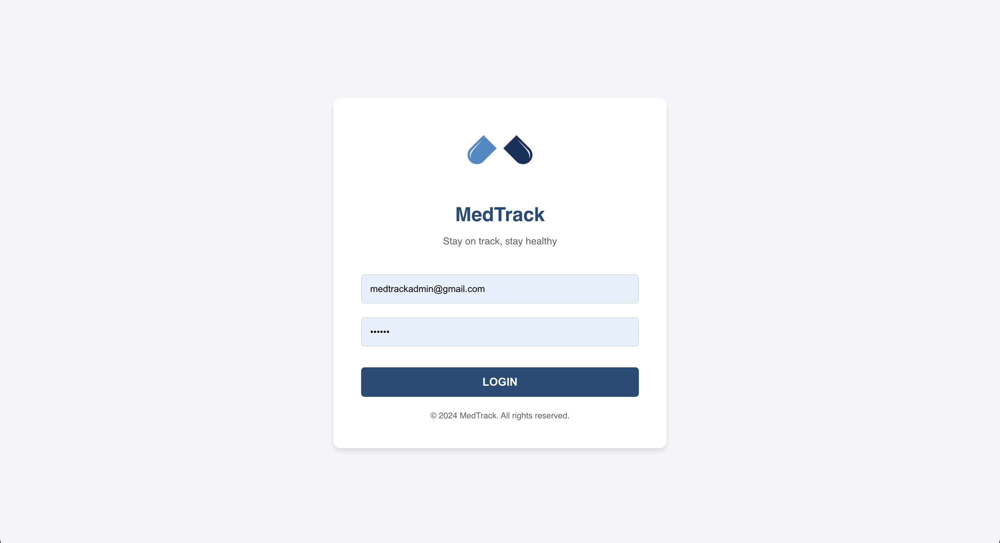
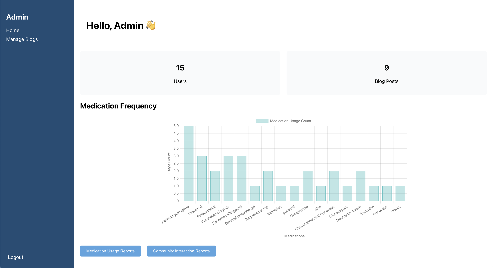
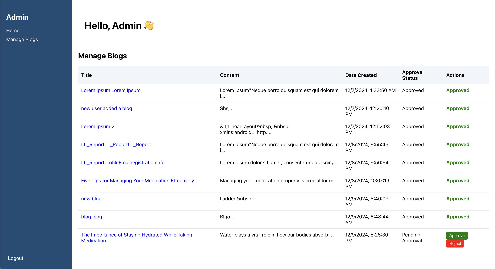
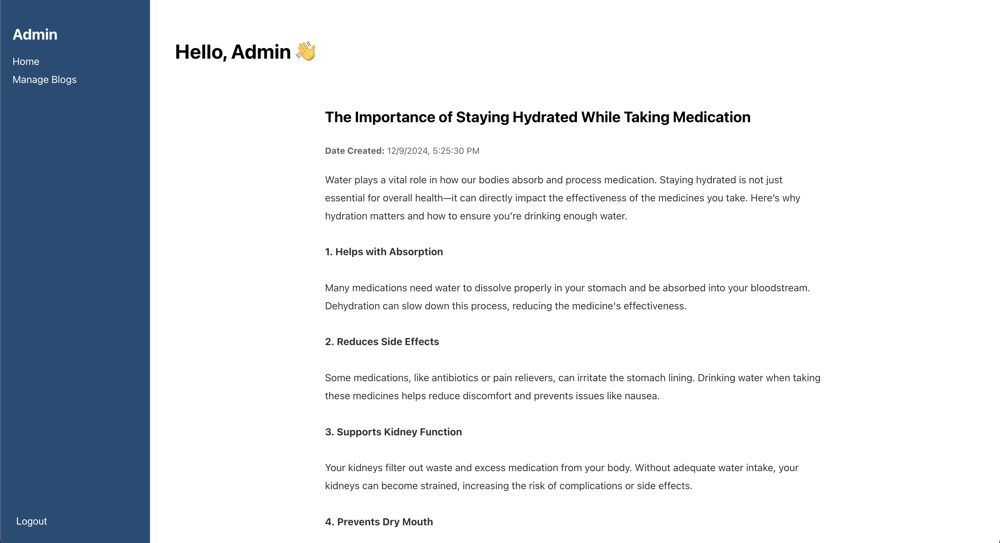

## MedTrack Admin Panel

The Med Track Admin Panel is a ReactJS web application that works alongside the [Med Track Mobile App](https://github.com/NifraWahaj/MedTrackV2) to manage and oversee community interactions and medication-related analytics. Built with Firebase as the backend, this panel allows admins to moderate content, generate reports, and manage user interactions efficiently.

## Functionalities

### 1. **User Management**

* View the total number of registered users.
* Access user profiles and analytics related to their activity.

### 2. **Blog Moderation**

* **Read Blogs for Approval**:
  * View all blogs submitted by users.
* **Approve or Reject Blogs**:
  * Approve blogs to make them visible in the community feed.
  * Reject inappropriate or irrelevant blogs.

### 3. **Medication Analytics**

* **Graphical Data**:
  * Visualize medication trends with interactive graphs.
  * Display data on total medications logged by users.
* **Reports Generation**:
  * Generate detailed reports on medication usage.
  * Provide insights into user adherence trends and refill patterns.

### 4. **Community Analytics**

* **Reports**:
  * Generate reports on community activity, including blogs posted, ratings, and reviews.
  * Analyze engagement levels and user contributions.

## Technologies Used

* ReactJS
* Firebase
  * Firebase Authentication
  * Firebase Firestore (Database)

## Screenshots

